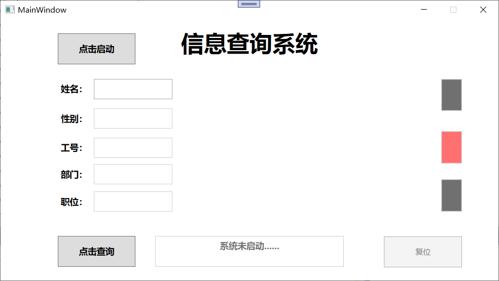

### 大致代码：

```csharp
public void Get_sql_server()
		{
			string D_xt =input_name1.Text;
			try
			{
				//连接loacel sql server
				string connStr = "Data Source=AE86-LIUKE;Initial Catalog=Test_WPF;User ID=sa;Pwd=xiaolan520126";
				string select_sql = "Select * from TUser where TName ='" + D_xt + "';";
				SqlConnection Connet_sql = new SqlConnection(connStr);
				Connet_sql.Open();//构造函数open sql server 

				SqlCommand cmd = new SqlCommand(select_sql, Connet_sql);//执行数据库查询函数
				SqlDataReader checkstr=cmd.ExecuteReader();//只读取model(ExecuteReader)
				if (checkstr.HasRows)//是否存在数据
				{
					while (checkstr.Read())//每行读取
					{
						//Alarm.AppendText(checkstr["Gonghao"].ToString() + "\r\n");
						out_2.Text = checkstr["Xb"].ToString();//填充字符串
						out_3.Text = checkstr["Gonghao"].ToString();
						out_4.Text = checkstr["Bm"].ToString();
						out_5.Text = checkstr["Zhiw"].ToString();
						images_get(checkstr["img"].ToString());
						Restart.IsEnabled = true;
					}
				}
				else
				{
					Alarm.Text= "未查询到信息.........";
					MessageBox.Show("未查询到信息.........");
				}
				checkstr .Close();
				Connet_sql.Close();//关闭连接
			}
			catch (Exception ex)//捕获异常
			{
				MessageBox.Show("错误信息：" + ex.Message, "SQL连接失败");
			}
		}
```
